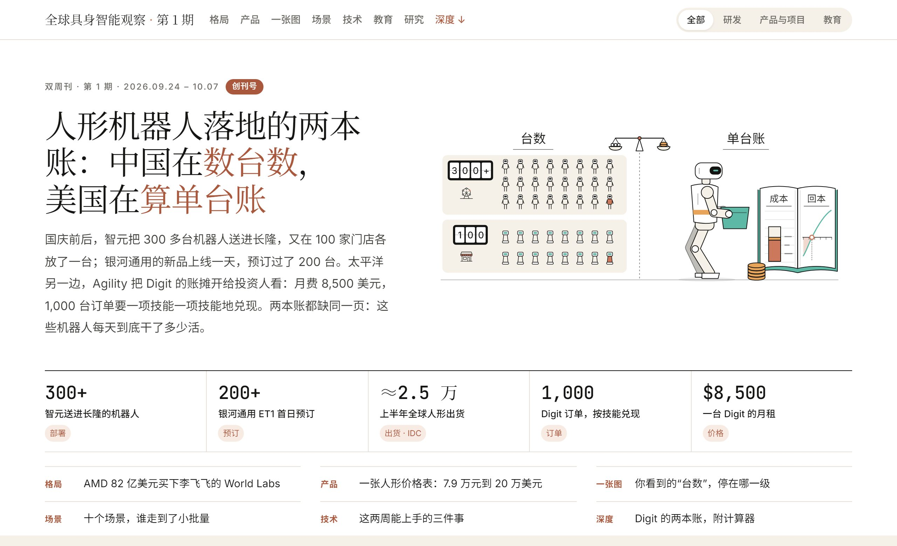

# 全球具身智能观察

持续跟踪具身智能的一手信源，筛出价值最高的新闻和落地案例，按工程师、产品/项目经理和教育者关心的问题拆解。两周一期，中文为主，附英文摘要。

每条写清四件事：是什么（版本、参数、许可），能不能用（价格、获取方式、硬件门槛），对研发、产品与项目、教育各有什么影响，还缺什么证据。

**[网站](https://buildwithamy.github.io/embodied-intelligence-observatory/)** · [全部期刊](#全部期刊) · [方法与信源](#方法与信源)

<!-- issues:start -->

## 最新一期

**第 1 期 · 创刊号 · 2026.09.24–10.07**

### 人形机器人陆续落地，干了多少活几乎没人公开：拆解 Digit 5 的成本与验收 · 10 个场景的落地进度 · 可以上手的模型和工具

[](https://buildwithamy.github.io/embodied-intelligence-observatory/issues/01/)

国内厂商公布的多是台数，智元把 300 多台机器人送进长隆；Agility 公布了单台机器的成本和回报，Digit 5 月租 8,500 美元，1,000 台订单要按技能逐项验收、分批交付。这些机器人每天工作多长时间、多久需要人工接管一次，两边都没有公开。

| 栏目 | 要点 |
|---|---|
| 交易 | AMD 以约 82 亿美元股票收购 World Labs；高通收购 MoveIt 维护方 PickNik；康耐视以约 5 亿美元收购 RealSense |
| 产品 | 人形机器人售价：银河通用 ET1 7.9 万元起，Astribot T1 1.8 万美元起，Digit 5 月租 8,500 美元 |
| 口径 | 厂商公布的“台数”分六级：产能、订单、出货、部署、在岗、有效工作 |
| 场景 | 10 个场景的落地进度，6 个部署案例的数据公开情况，厂商交付承诺台账 |
| 工具 | FLUX 3 Action、Physical AI Toolchain、Isaac ROS 5.0 等的交付形态、许可和硬件要求，附 3 个实验 |
| 教育 | 具身智能首次进入本科专业目录，9 所高校今年开始招生；附一份对比两种模型的实验课方案 |
| 案例 | 拆解 Digit 5：客户和厂商两侧的成本与回本，按技能验收的六项指标，附回本计算器 |

**[在线阅读第 1 期 →](https://buildwithamy.github.io/embodied-intelligence-observatory/issues/01/)**

## 全部期刊

| 期号 | 时间窗口 | 主题 |
|---|---|---|
| [第 1 期（创刊号）](https://buildwithamy.github.io/embodied-intelligence-observatory/issues/01/) | 2026.09.24–10.07 | 人形机器人陆续落地，干了多少活几乎没人公开：拆解 Digit 5 的成本与验收 · 10 个场景的落地进度 · 可以上手的模型和工具 |

下一期：第 2 期，2026.10.08–10.18，制作中。

<!-- issues:end -->

## 方法与信源

### 信源

- 一手优先：公司新闻稿、监管文件、国家标准、政府和高校公告、GitHub 与 Hugging Face 的发布页。
- 写完对照 The Robot Report、Humanoids Daily、RobotToday、21 世纪经济报道等行业媒体查漏，每期“编后”写明查了哪些源。
- 信源分类和各自服务的栏目，见 [改进方案 V2](docs/EIO_改进方案_V2.md) 第七节。

### 筛选

| 维度 | 权重 | 看什么 |
|---|---|---|
| 落地证据 | 25% | 是否进入真实场景，规模，有没有运行数据（时长、成功率、节拍、接管次数） |
| 可用性与可借鉴性 | 25% | 工程师能否用上（开源、可购买、有 SDK），产品和项目能否借鉴（方案、指标、流程） |
| 能力边界变化 | 20% | 是否让某类任务从“做不到”变成“能试” |
| 影响面 | 15% | 影响一个产品，还是一类场景或整个开发生态 |
| 证据质量 | 10% | 官方、多方确认 > 公司自述 > 媒体报道 |
| 教育价值 | 5% | 能否直接进课程、实训或竞赛 |

重大投融资单独判断：先看对行业的影响，再看金额。不做估值和股价分析。

### 证据

- 每条标注证据等级：官方（公告、监管文件、论文）、公司自述（演示、投资者材料）、媒体（还没回到一手来源）、说明（评测范围或观点）。
- 台数按六级口径看：产能、订单、出货、部署、在岗、有效工作。
- 厂商没公开的数据留空，不替它们补；公开过的交付时间记进台账，到期对账。
- 资料整理、写作和插画由 AI 辅助完成，编辑审阅后发布。插画源文件保留 C2PA 内容凭证。

## 仓库结构

| 路径 | 内容 |
|---|---|
| `site/issues.toml` | 期刊目录；网站首页和本 README 的期刊列表都由它生成 |
| `site/issues/01/` | 第 1 期页面；`src/` 下是页面模板、原创插画和构建脚本 |
| `site/home.html`、`site/build.py` | 首页模板和整站构建脚本 |
| `docs/EIO_改进方案_V2.md` | 定位、栏目、选题标准和信源 |
| `docs/写作规范.md` | 标题、术语、公司名、数字单位和证据标注的写作规范 |
| `HANDOFF.md` | 维护交接说明 |
| `src/`、`config/`、`prompts/`、`tests/` | V0.4 新闻发现流水线（Python），后续改造成每日抓取 |
| `docs/history/` | V0.1–V0.4 的任务书和过程记录 |
| `.github/workflows/pages.yml` | 构建并部署到 GitHub Pages |

## 本地预览与发布

```bash
python site/build.py
python -m http.server 8000 --directory site
```

打开 <http://localhost:8000> 看首页，<http://localhost:8000/issues/01/> 看第 1 期。

发布新的一期：页面放进 `site/issues/<期号>/`，在 `site/issues.toml` 最前面加一条，运行 `python site/build.py`，提交并推送到 `main`，Actions 会自动构建和部署。

V0.4 流水线的安装和测试（Windows 把 `.venv/bin/python` 换成 `.venv\Scripts\python`）：

```bash
python -m venv .venv
.venv/bin/python -m pip install -e ".[dev]"
.venv/bin/python -m pytest -q
```

用法见 [运行指南](docs/manual_run.md) 和 [架构说明](docs/architecture.md)。W40 的抓取数据和原文快照含第三方文章全文，没有放进公开仓库，依赖它们的回归测试会自动跳过。

## 路线图

1. **内容格式与渲染器**：每期写一份 Markdown，正文用可视化块描述图表，由渲染器生成页面。
2. **事件库与实体库**：产品、场景、工具、故事线和承诺台账跨期累积；GitHub Actions 每日抓取。
3. **常设页面**：场景地图、产品库、工具表和故事线。

## 参与

发现漏掉的事件、写错的数字，或者想推荐信源，欢迎[提 Issue](https://github.com/buildwithamy/embodied-intelligence-observatory/issues)。

## 许可

- 代码（`src/`、`tests/`、`scripts/`、构建脚本和工作流）：[MIT](LICENSE)
- 刊物内容（文字、图表数据和原创插画）：[CC BY-NC-SA 4.0](LICENSE-CONTENT.md)
- 引用的第三方资料版权归原作者所有，本刊只做摘录并附链接。
